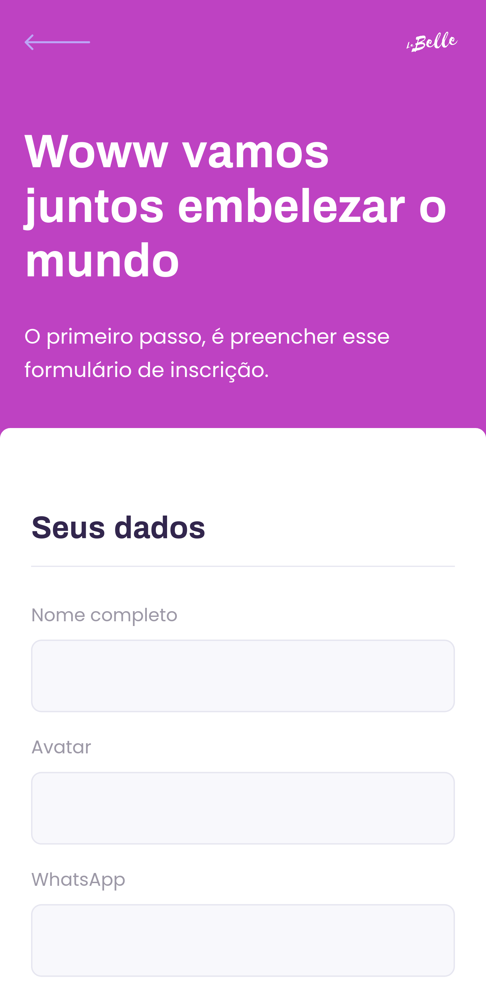
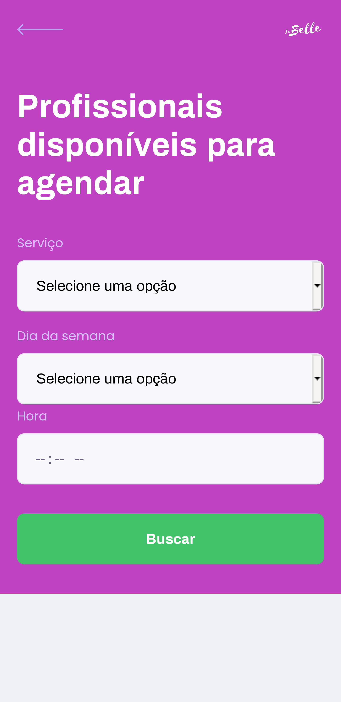
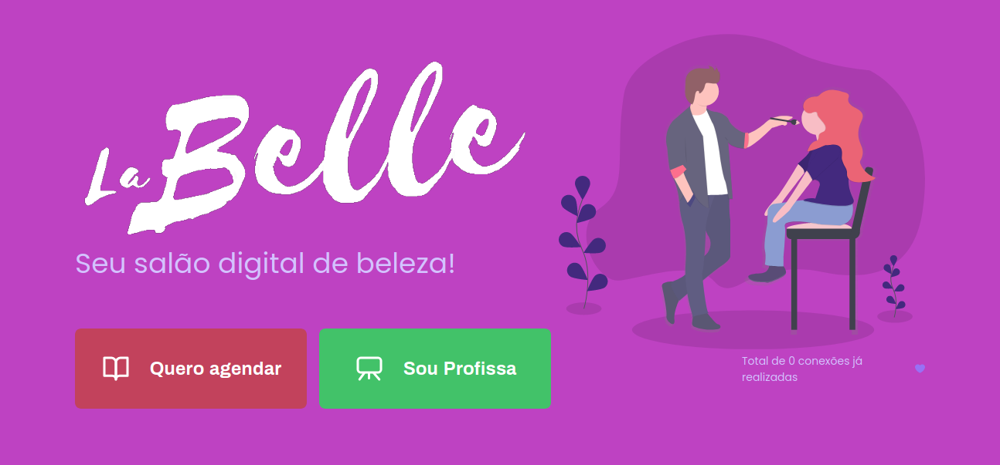
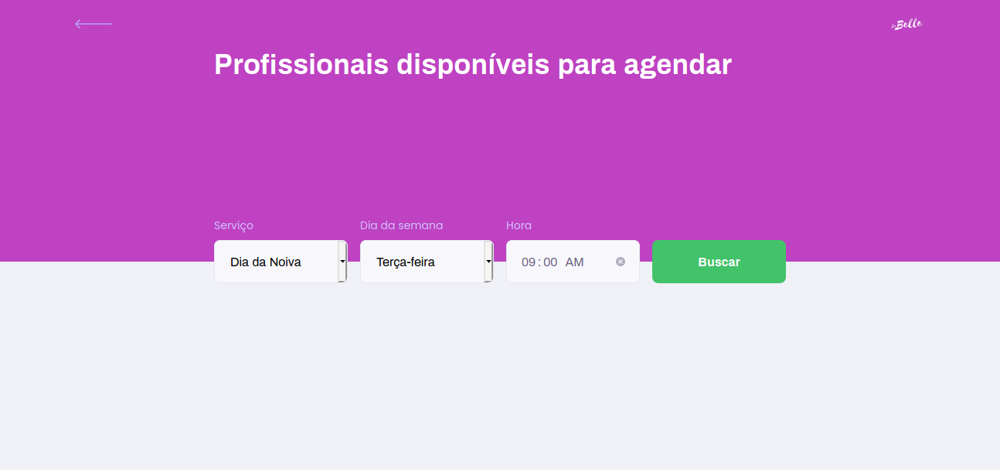

<p align="center">
  

  

  <a href="https://www.twitter.com/wellingtoncid/">
    
  </a>
  
  <a href="https://github.com/wellingtoncid/README/commits/master">
    
  </a>
    
   
   <a href="https://github.com/wellingtoncid/README-proffy/stargazers">
    
  </a>

  <a href="https://linkedin.com/in/wellingtoncid">
    
  </a>    
 
</p>
<h1 align="center">
    
</h1>

<h4 align="center"> 
	🚧  La Belle em construção 🚀 🚧
</h4>

<p align="center">
 <a href="#-sobre-o-projeto">Sobre</a> •
 <a href="#-funcionalidades">Funcionalidades</a> •
 <a href="#-layout">Layout</a> • 
 <a href="#-como-executar-o-projeto">Como executar</a> • 
 <a href="#-tecnologias">Tecnologias</a> • 
 <a href="#-contribuidores">Contribuidores</a> • 
 <a href="#-autor">Autor</a> • 
 <a href="#user-content--licença">Licença</a>
</p>


## 💻 Sobre o projeto

La Belle - é uma forma de conectar profissionais de beleza as pessoas que procuram se embelezar de forma mais prática e fácil.


Projeto desenvolvido durante a milha extra na **NLW - Next Level Week 2** oferecida pela [Rocketseat](https://blog.rocketseat.com.br/).
O NLW é uma experiência online com muito conteúdo prático, desafios e hacks onde o conteúdo fica disponível durante uma semana.

---

## ⚙️ Funcionalidades

- [x] Profissionais de beleza podem se cadastrar na plataforma web enviando:
  - [x] uma imagem do seu avatar
  - [x] nome completo e whatsapp
  - [x] valor do serviço para aparecer no card
  - [x] além de selecionar uma ou mais serviços como: 
    - Matização dos fios
    - Design de sobrancelhas
    - Massagem relaxante
    - Automaquiagem
    - Spa de mãos
    - Spa de pés
    - Dia da Noiva
    - entre outras

- [x] Os usuários tem acesso ao aplicativo móvel, onde podem:
  - [x] navegar pelo cards para ver os profissionais cadastradas
  - [x] entrar em contato com os Profissas através do WhatsApp

---

## 🎨 Layout

<!-- O layout da aplicação estará disponível em breve:

<a href="https://www.figma.com/file/Agvethfp7FANyXDDU3LUfd/Proffy-Web-2.0">
  
</a>


<a href="https://www.figma.com/file/nZ7lMEBYZSMhRxfdvy6fKz/Proffy-Mobile-2.0">
  
</a> -->


### Mobile

<p align="center">
  

  

  

</p>

### Web

<p align="center" style="display: flex; align-items: flex-start; justify-content: center;">
  

  
</p>

---

## 🚀 Como executar o projeto

Este projeto é divido em três partes:
1. Backend (pasta server) 
2. Frontend (pasta web)
3. Mobile (pasta mobile)

💡Tanto o Frontend quanto o Mobile precisam que o Backend esteja sendo executado para funcionar.

### Pré-requisitos

Antes de começar, você vai precisar ter instalado em sua máquina as seguintes ferramentas:
[Git](https://git-scm.com), [Node.js](https://nodejs.org/en/), [Expo](https://expo.io/). 
Além disto é bom ter um editor para trabalhar com o código como [VSCode](https://code.visualstudio.com/)

#### 🎲 Rodando o Backend (servidor)

```bash

# Clone este repositório
$ git clone git@github.com:wellingtoncid/labelle.git

# Acesse a pasta do projeto no terminal/cmd
$ cd proffy

# Vá para a pasta server
$ cd server

# Instale as dependências
$ npm install ou yarn install

# Execute a aplicação em modo de desenvolvimento
$ npm run dev:server

# O servidor inciará na porta:3333 - acesse http://localhost:3333 

```
<p align="center">
  <a href="https://github.com/wellingtoncid/labelle/blob/master/insomnia-labelle.json" target="_blank"></a>
</p>


#### 🧭 Rodando a aplicação web (Frontend)

```bash

# Clone este repositório
$ git clone git@github.com:wellingtoncid/labelle.git

# Acesse a pasta do projeto no seu terminal/cmd
$ cd proffy

# Vá para a pasta da aplicação Front End
$ cd web

# Instale as dependências
$ npm install ou yarn install

# Execute a aplicação em modo de desenvolvimento
$ npm run start ou yarn start

# A aplicação será aberta na porta:3000 - acesse http://localhost:3000

```

---

## 🛠 Tecnologias

As seguintes ferramentas foram usadas na construção do projeto:

#### **Website**  ([React](https://reactjs.org/)  +  [TypeScript](https://www.typescriptlang.org/))

-   **[React Router Dom](https://github.com/ReactTraining/react-router/tree/master/packages/react-router-dom)**
-   **[React Icons](https://react-icons.github.io/react-icons/)**
-   **[Axios](https://github.com/axios/axios)**
<!-- -   **[Leaflet](https://react-leaflet.js.org/en/)** -->
<!-- -   **[React Leaflet](https://react-leaflet.js.org/)** -->
<!-- -   **[React Dropzone](https://github.com/react-dropzone/react-dropzone)** -->

> Veja o arquivo  [package.json](https://github.com/wellingtoncid/labelle/blob/master/web/package.json)

#### [](https://github.com/wellingtoncid/Ecoleta#server-nodejs--typescript)**Server**  ([NodeJS](https://nodejs.org/en/)  +  [TypeScript](https://www.typescriptlang.org/))

-   **[Express](https://expressjs.com/)**
-   **[CORS](https://expressjs.com/en/resources/middleware/cors.html)**
-   **[KnexJS](http://knexjs.org/)**
-   **[SQLite](https://github.com/mapbox/node-sqlite3)**
-   **[ts-node](https://github.com/TypeStrong/ts-node)**
<!-- -   **[dotENV](https://github.com/motdotla/dotenv)** -->
<!-- -   **[Multer](https://github.com/expressjs/multer)** -->
<!-- -   **[Celebrate](https://github.com/arb/celebrate)** -->
<!-- -   **[Joi](https://github.com/hapijs/joi)** -->

> Veja o arquivo  [package.json](https://github.com/wellingtoncid/labelle/blob/master/server/package.json)

#### [](https://github.com/wellingtoncid/Ecoleta#mobile-react-native--typescript)**Mobile**  ([React Native](http://www.reactnative.com/)  +  [TypeScript](https://www.typescriptlang.org/))

-   **[Expo](https://expo.io/)**
-   **[Expo Google Fonts](https://github.com/expo/google-fonts)**
-   **[React Navigation](https://reactnavigation.org/)**
<!-- -   **[React Native Maps](https://github.com/react-native-community/react-native-maps)** -->
-   **[Expo Constants](https://docs.expo.io/versions/latest/sdk/constants/)**
-   **[React Native SVG](https://github.com/react-native-community/react-native-svg)**
-   **[Axios](https://github.com/axios/axios)**
<!-- -   **[Expo Location](https://docs.expo.io/versions/latest/sdk/location/)** -->
<!-- -   **[Expo Mail Composer](https://docs.expo.io/versions/latest/sdk/mail-composer/)** -->

> Veja o arquivo  [package.json](https://github.com/wellingtoncid/labelle/blob/master/mobile/package.json)

#### [](https://github.com/wellingtoncid/Ecoleta#utilit%C3%A1rios)**Utilitários**

-   Protótipo:  **[Figma](https://www.figma.com/)**  →  **[Protótipo (Proffy)](https://www.notion.so/Layout-Proffy-3d5f45f54ec54ef9b2103565b7cce4e1)**
<!-- -   API:  **[IBGE API](https://servicodados.ibge.gov.br/api/docs/localidades?versao=1)**  →  **[API de UFs](https://servicodados.ibge.gov.br/api/docs/localidades?versao=1#api-UFs-estadosGet)**,  **[API de Municípios](https://servicodados.ibge.gov.br/api/docs/localidades?versao=1#api-Municipios-estadosUFMunicipiosGet)**
-   Maps:  **[Leaflet](https://react-leaflet.js.org/en/)** -->
-   Editor:  **[Visual Studio Code](https://code.visualstudio.com/)**  → Extensions:  **[SQLite](https://marketplace.visualstudio.com/items?itemName=alexcvzz.vscode-sqlite)**
-   Markdown:  **[StackEdit](https://stackedit.io/)**,  **[Markdown Emoji](https://gist.github.com/rxaviers/7360908)**
<!-- -   Commit Conventional:  **[Commitlint](https://github.com/conventional-changelog/commitlint)** -->
-   Teste de API:  **[Insomnia](https://insomnia.rest/)**
-   Ícones:  **[Feather Icons](https://feathericons.com/)**,  **[Font Awesome](https://fontawesome.com/)**
-   Fontes:  **[Archivo](https://fonts.google.com/specimen/Archivo)**,  **[Poppins](https://fonts.google.com/specimen/Poppins)**


---

## 👨‍💻 Contribuidores

💜 Um super thanks 👏 para a galera da Rocketseat que fez esse produto sair do campo da ideia e futuramente vai entrar nas lojas de aplicativos :)

<table>
  <tr>
    <td align="center"><a href="https://linkedin.com/in/wellingtoncid"><br /><sub><b>Wellington Cid</b></sub></a><br /><a href="https://linkedin.com/in/wellingtoncid" title="Rocketseat">👨‍🚀</a></td>
    <!-- <td align="center"><a href="https://rocketseat.com.br"><br /><sub><b>Diego Fernandes</b></sub></a><br /><a href="https://rocketseat.com.br/" title="Rocketseat">👨‍🚀</a></td>
    <td align="center"><a href="https://rocketseat.com.br"><br /><sub><b>Cleiton Souza</b></sub></a><br /><a href="https://rocketseat.com.br/" title="Rocketseat">👨‍🚀</a></td>
    <td align="center"><a href="https://rocketseat.com.br"><br /><sub><b>Robson Marques</b></sub></a><br /><a href="https://rocketseat.com.br/" title="Rocketseat">👨‍🚀</a></td>
    <td align="center"><a href="https://rocketseat.com.br"><br /><sub><b>Claudio Orlandi</b></sub></a><br /><a href="https://rocketseat.com.br/" title="Rocketseat">🚀</a></td>
    <td align="center"><a href="https://rocketseat.com.br"><br /><sub><b>Vinícios Fraga</b></sub></a><br /><a href="https://rocketseat.com.br/" title="Rocketseat">🚀</a></td>
    <td align="center"><a href="https://rocketseat.com.br"><br /><sub><b>Hugo Duarte</b></sub></a><br /><a href="https://rocketseat.com.br/" title="Rocketseat">🚀</a>  <a href="https://blog.rocketseat.com.br/" title="Blog">🌐</a></td>
     -->
  </tr>
  <tr>
    <!-- <td align="center"><a href="https://rocketseat.com.br"><br /><sub><b>Joseph Oliveira</b></sub></a><br /><a href="https://rocketseat.com.br/" title="Rocketseat">🚀</a></td>
    <td align="center"><a href="https://rocketseat.com.br"><br /><sub><b>Guilherme Rodz</b></sub></a><br /><a href="https://rocketseat.com.br/" title="Rocketseat">🚀</a></td>
    <td align="center"><a href="https://rocketseat.com.br"><br /><sub><b>Mayk Brito</b></sub></a><br /><a href="https://rocketseat.com.br/" title="Rocketseat">🚀</a></td>
    <td align="center"><a href="https://rocketseat.com.br"><br /><sub><b>João Paulo</b></sub></a><br /><a href="https://rocketseat.com.br/" title="Rocketseat">🚀</a></td>
    <td align="center"><a href="https://rocketseat.com.br"><br /><sub><b>Luke Morales</b></sub></a><br /><a href="https://rocketseat.com.br/" title="Rocketseat">🚀</a></td>
     <td align="center"><a href="https://rocketseat.com.br"><br /><sub><b>Luiz Batanero</b></sub></a><br /><a href="https://rocketseat.com.br/" title="Rocketseat">🚀</a></td>
     -->
  </tr>
</table>

## 💪 Como contribuir para o projeto

1. Faça um **fork** do projeto.
2. Crie uma nova branch com as suas alterações: `git checkout -b my-feature`
3. Salve as alterações e crie uma mensagem de commit contando o que você fez: `git commit -m "feature: My new feature"`
4. Envie as suas alterações: `git push origin my-feature`
> Caso tenha alguma dúvida confira este [guia de como contribuir no GitHub](./CONTRIBUTING.md)

---

## 🦸 Autor

<a href="https://linkedin.com/in/wellingtoncid/">
 
 <br />
 <sub><b>Wellington Cid</b></sub></a> <a href="https://linkedin.com/in/wellingtoncid/" title="Rocketseat">🚀</a>
 <br />

[](https://twitter.com/wellingtoncid) [](https://www.linkedin.com/in/wellingtoncid/) 
[](mailto:cid.wellington@gmail.com)

---

## 📝 Licença

Este projeto esta sob a licença [MIT](./LICENSE).

Feito com ❤️ por Wellington Cid 👋🏽 [Entre em contato!](https://www.linkedin.com/in/wellingtoncid/)

---
<!-- 
##  Versões do README

[Português 🇧🇷](./README.md)  |  [Inglês sem emojis 🇺🇸](./README-en.md) | [Portugues sem logo  🇧🇷](./README-sem-logo.md)  -->
